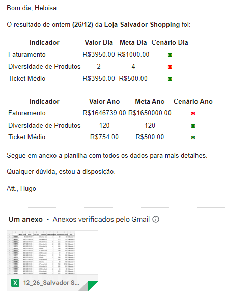

# RPA One Page Report

## Project Scenario Description

Working in a chain of clothing stores with over 25 outlets in Brazil. Every morning
the Data Analysis team calculates the so-called One Pages of each individual store and
sends them to each Store Manager.

A One Page is a report that displays the Performance Indicators used by the
store management team to understand how their individual store is performing in
comparison to all other stores in the chain and if the yearly or daily goal was achieved.

## Project's Objective

As a Data Analyst, the objective here is to create a Process Automation (RPA) to calculate
the One Page Report of each individual store and send an e-mail to the respective store manager
containing the One Page Report and a file containing all the details of their performance
during that period of time.

At last, it is necessary to send e-mail report to the General Management regarding
the best performing store (both yearly and daily) and the worst performing store (both yearly and daily).

Note 1: in this scenario "daily" refers to the December 26th, which was the latest database update day
as of the making of this project.

### Packages used:
+ pandas
+ pathlib
+ win32com.client

Note 2: Hypertext Transfer Protocol (HTTP) was also used for the e-mail construction.

## Performance Indicators
+ Billing: Yearly Goal(1,650,000) and Daily Goal(1,000);
+ Products Diversity (how many different types of products were sold in that period):
Yearly Goal(120) and Daily Goal(4);
+ Average Ticket: Yearly Goal(500) and Daily Goal(500).

## About the Database
+ "Emails2.xlsx" is a file that contains the store name, the respective manager's name
and the manager's e-mail address;
+ "Lojas.xlsx" contains the name of each store;
+ "Vendas.xlsx" contains the sales code, sales date, store's ID, product sold, sold amount,
unit value, sales value.

## End Result

Each e-mail will have the following appearance, containing the One Page Report and an
Excel file attached with the detailed information of the respective store.

 Note 3: this is a project developed for academic purposes, therefore the
data contained in "Base de Dados" and "Backup Arquivos Lojas" as well as this Project's Scenario
are fictitious.
